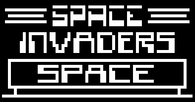

# Chip-8 Emulator for Flutter

A simple Chip-8 emulator implemented in Dart for Flutter, allowing you to run Chip-8 programs on your Flutter application.

## Introduction

Chip-8 is an interpreted programming language that was initially designed for the COSMAC VIP computer in the mid-1970s. It was used to develop simple video games for systems, such as the Telmac 1800 and the COSMAC VIP.

This emulator provides a Chip-8 interpreter, capable of executing Chip-8 programs, and it includes components like a monitor (display), keyboard input handling, and various utility functions.

## Features

- **Chip-8 Interpreter**: Allows execution of Chip-8 programs.
- **Monitor**: Provides a display for rendering Chip-8 graphics.
- **Keyboard Input Handling**: Handles input from the keyboard to interact with Chip-8 programs.
- **Customizable Speed**: Adjust the speed of the emulator to control the execution rate of - Chip-8 programs.

## Contributing

Contributions are welcome! If you find any bugs or want to suggest enhancements, please open an issue or create a pull request on GitHub.

